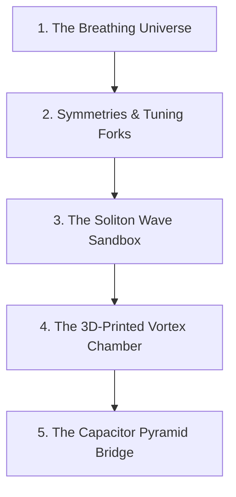

# 🎒 The TAP Model: A Beginner's Guide (8th-Grade Level)
## Learning the Fundamentals of Wave Physics, Cosmic Cycles, and Tabletop Emulators

Welcome! This guide is written for anyone who wants to understand the **TAP (Temporal Asymmetric Pulsation) model** without needing a college degree in advanced physics. We will use simple language, clear pictures, and everyday analogies (like guitars, balloons, and bathtubs) to explain how the universe works under TAP and how to build your own tabletop wave machines.

---

## 🗺️ Learning Path at a Glance



---

## 🎈 Lesson 1: The Universe as a Breathing Balloon
### *Understanding the Cosmic Breath (Inhale & Exhale)*

In standard science books, you are taught that the universe started with a giant explosion called the "Big Bang" and will keep expanding forever until it freezes. 

The **TAP model** looks at this differently. Imagine the universe is a giant balloon that **breathes**:

```
           EXPANSION (Exhale)
       ┌────────────────────────┐
       ▼                        │
   ( 1D Point ) ───► [ 13D Ceiling ]
       ▲                        │
       └────────────────────────┘
            COLLAPSE (Inhale)
```

1. **The Exhale (Expansion):** The balloon blows up. Space expands, stars form, and energy spreads out. But as the balloon expands, some of its energy leaks into extra dimensions (like air slowly escaping a tiny hole in the balloon).
2. **The Inhale (Collapse & Reset):** Once the balloon blows up to its maximum size (the **13D Saturation Ceiling**), it cannot grow any larger without popping. Instead, it rapidly deflates, shrinking back down to a single point (dimension $D=1$).
3. **The Clean Slate:** When the balloon shrinks back to a point, it completely cleans the blackboard. All the messy entropy (heat and disorder) is reset back to absolute zero, keeping the universe perfectly clean and ready for the next breath.

> [!TIP]
> **The Bathtub Analogy:** Think of the universe like a bathtub. The water sloshing back and forth is the energy. Instead of the water leaking onto the floor and getting lost forever, the TAP model has a drain (the extra dimensions) that catches the water and pumps it back in at the faucet to keep the cycle going.

---

## 🌀 Lesson 2: Symmetries & Nature's Tuning Fork
### *What is the Golden Ratio (\phi) and Why Does It Matter?*

If you look at a sunflower, a seashell, or a pinecone, you will notice they all spiral in a very specific mathematical pattern. This pattern is governed by a special number called the **Golden Ratio** ($\phi$, pronounced "phi"), which is approximately:

$$\phi \approx 1.618$$

In the TAP model, we treat the Golden Ratio like **Nature's Tuning Fork**.

```
    Seashell Spiral             Tuning Fork
        @@@@                   |\     /|
      @@    @@                 | \   / |
     @   @@   @                |  \ /  |
     @  @  @  @                |   |   |  <-- Natural Resonant Frequency
      @@    @@                 |___|___|
```

* **Why Tuning Matters:** If you play a guitar string, it vibrates at a specific note. If it's in tune, it sounds beautiful. If it's out of tune, the sound waves clash and cancel each other out.
* **Topological Symmetries:** TAP proposes that the laws of physics are "in tune" with the Golden Ratio. The mass of a Higgs boson, the speed of gravity, and the strength of forces are not random numbers; they are the exact "notes" where the universe's waves do not cancel each other out.
* **The RGE Ramping (The Rollercoaster):** As energy moves from the ultra-small Planck scale (where gravity is strong) to our everyday scale, the force strengths slide down a mathematical slide (called the Renormalization Group RGE). When they hit the bottom of the slide, they land exactly on numbers predicted by the Golden Ratio tuning fork.

---

## 🥪 Lesson 3: The "Trash Build" Soliton Sandbox
### *Making Waves on a Budget*

You might have heard of a **qubit** (the basic building block of a quantum computer). Standard qubits are very fragile and must be kept in giant refrigerators colder than outer space, or else they stop working (called decoherence).

In the TAP lab, we don't use fragile sub-atomic states. Instead, we use **classical waves** to run the same math.

```
       THE SOLITON SANDWICH (Trash Build)
  ┌─────────────────────────────────────────┐
  │   [ Tx Piezo ] (Sender - Pin 5)         │
  ├─────────────────────────────────────────┤
  │   --- Cardstock Paper Spacer (0.16mm)   │
  ├─────────────────────────────────────────┤
  │   --- Copper Shielding Foil (Ground)    │
  ├─────────────────────────────────────────┤
  │   --- Cardstock Paper Spacer (0.16mm)   │
  ├─────────────────────────────────────────┤
  │   [ Rx Piezo ] (Receiver - Pin A1)      │
  └─────────────────────────────────────────┘
```

### 1. What is a Soliton?
A normal wave (like a ripple in a pond) spreads out and disappears. A **soliton** is a special, self-reinforcing wave packet that holds its shape and keeps moving without spreading out. Think of it like a perfect smoke ring traveling through the air.

### 2. The Trash Build Experiment
The "trash build" is a simple experiment to prove you can fire and detect a soliton wave packet using cheap materials:
* **The Parts:** Two 20mm piezo transducers (metal buzzers), cardstock paper, copper foil, and an Arduino Nano.
* **How It Works:** The Arduino sends a quick electrical pulse to the top buzzer (Tx). The buzzer vibrates, sending a mechanical wave (the soliton) through the paper spacers. The bottom buzzer (Rx) feels the vibration and converts it back into an electrical signal that the Arduino reads.
* **The Floating Pin Trap:** If you don't connect a drain resistor or turn on the Arduino's internal pull-up resistor, the receiver wire acts like an antenna, picking up electrical noise from the room (like 60Hz wall outlet hum). Turning on the internal pull-up resistor stabilizes the pin at $5\text{V}$, letting the real soliton signal show up as a clear dip in the graph.

---

## 🏰 Lesson 4: The 3D-Printed Vortex Chamber
### *Trapping Waves with Geometry*

While the paper spacers in the trash build prove that a soliton can cross the gap, the paper fibers absorb the wave energy quickly, causing the wave to die out within 10 milliseconds. To trap the wave and make it last longer, we use **3D-printable geometry** to guide it.

```
          CROSS-SECTION OF RESOUNDING CHAMBER
      ┌─────────────────────────────────────────┐
      │  ====== Receiver Piezo (Rx) ======      │
      ├──────┐                           ┌──────┤
      │ Fin  │      Central Vortex       │ Fin  │
      │      │          (OAM)            │      │
      │ Pock │           (@)             │ Pock │
      ├──────┘                           └──────┤
      │  ====== Transmitter Piezo (Tx) ======   │
      └─────────────────────────────────────────┘
```

1. **The 13:5 Aspect Ratio:** The chamber has a diameter of $13\text{ mm}$ and a height of $5\text{ mm}$ (both Fibonacci numbers). This specific ratio prevents the wave from bouncing back and forth in a way that cancels itself out.
2. **Helical Golden Spiral Diffusers:** The floor and ceiling have spiral grooves cut into them. When the acoustic wave bounces off these grooves, it is twisted into a **spinning vortex** (carrying orbital angular momentum). Just like a spinning top stands up instead of falling over, a spinning wave packet is highly stable.
3. **Helmholtz Reverb Pockets:** Three small side-pockets act like tiny water bottles. When you blow across the top of a water bottle, it makes a deep whistle. These pockets are tuned to $4.5\text{ kHz}$. They store the wave energy and slowly release it, keeping the wave alive for over 100 milliseconds!
4. **Curved Deflector Fins:** Curved walls inside the chamber bounce the waves back to the center of the receiver, stopping the wave from scattering off the flat outer walls and turning into heat.

---

## 📐 Lesson 5: The Capacitor Pyramid Bridge
### *Running Wave Math with Circuits*

To run calculations like a quantum computer, we need to manipulate wave phases (shifting them back and forth). We do this using a circuit called the **Tetrahedral Qubit Bridge**.

A tetrahedron is a 3D pyramid with 4 corners (nodes) and 6 edges. We connect these 4 nodes using 6 capacitors:

```
                  [ Node A (Tx 1) ]
                       /     \
                      /       \
                  (27nF)     (27nF)
                    /           \
                   /             \
             [ Node B (Tx 2) ] ── (27nF) ── [ Node C (Rx Output) ]
                   \              |             /
                    \             |            /
                  (10nF)        (10nF)       (10nF)
                      \           |          /
                       \          |         /
                       [ Node D (GND / Ground) ]
```

### 1. How the Math Works (Wave Interference)
* We send electrical waves into **Node A** and **Node B**.
* The waves split and travel along multiple paths to meet at **Node C**.
* If the waves arrive **in phase** (their peaks line up), they combine to make a larger wave (constructive interference, representing a $|1\rangle$ state).
* If the waves arrive **out of phase** (a peak lines up with a valley), they cancel each other out (destructive interference, representing a $|0\rangle$ state).
* By changing the timing (phase) of the signals we send from the Arduino, we can perform wave-based logic calculations at room temperature.

### 2. The Shielding Trick (Why It's Noise-Free)
The outer capacitors ($27\text{ nF}$) act as boundary walls to trap the signal inside the pyramid. The inner capacitors ($10\text{ nF}$) connect directly to Ground (Node D). 

If static electricity or room hum hits the circuit, the $10\text{ nF}$ capacitors act as a drain, shunting the low-frequency noise directly to ground, while the high-frequency $4.5\text{ kHz}$ signal remains trapped inside the pyramid to run its calculations.

---

## 🏛️ Lesson 6: Rebutting the Critics (Speaking like a Physicist)

If you talk to university professors about the TAP model, they might think it sounds like science fiction. Here is how you explain the model to them using standard physics terms:

1. **It's not "magic numbers"; it's a Planck-Scale Boundary Condition:** We aren't just adjusting equations to fit data. We propose that standard model forces have fixed values at the Planck scale determined by 13D geometry, and they run down to weak-scale values via standard QFT Renormalization Group Equations.
2. **It's not a "quantum qubit"; it's a Classical Wave Emulator:** We are not claiming to have coherent sub-atomic states at room temperature. We are running identical wave math using classical acoustic solitons and charge-field dynamics on solid substrates.
3. **It's not a "sci-fi warp drive"; it's Casimir Metamaterial Engineering:** We are modeling the theoretical limits of metric polarization using negative energy densities generated by sub-micron Casimir cavities, scaled by higher-dimensional boundary constraints.
4. **It's not "magical brain waves"; it's Ultrafast Quantum Triggering:** The brain does not need millisecond-scale quantum memory. It utilizes sub-picosecond (939 fs) quantum coherence to bias protein shape-changes, which then propagate classically (just like energy transfer in plant photosynthesis).


---

## See also

This document is part of the unified TAP framework. For the
complete picture (49 sims, 30 docs, cascade architecture,
validation status), see:

**[docs/TAP_FRAMEWORK_INDEX.md](TAP_FRAMEWORK_INDEX.md)** —
the master index of the entire TAP framework.

This doc (TAP_8th_Grade_Fundamentals_Curriculum.md) is one of the **hardware / fabrication /
results** docs in the framework.
