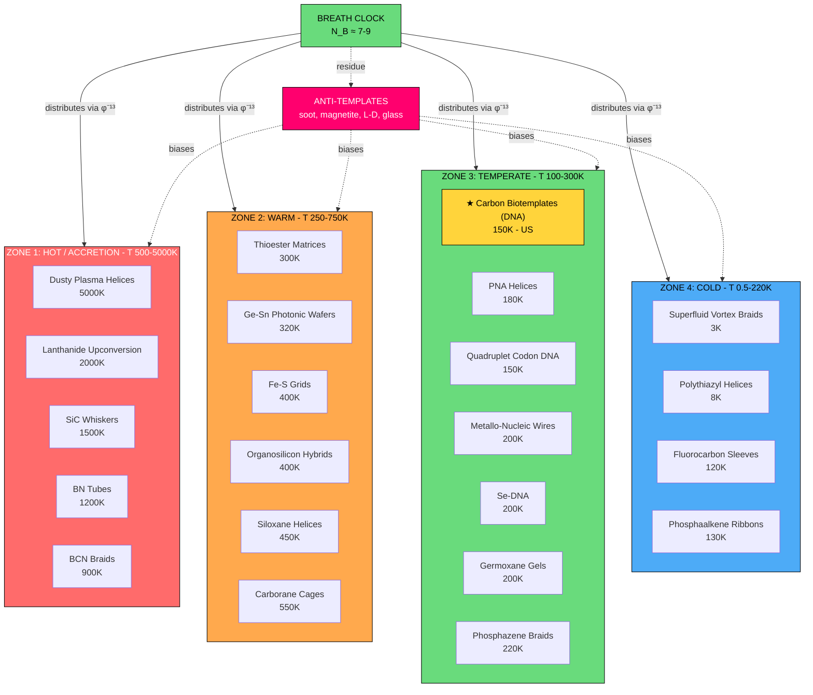
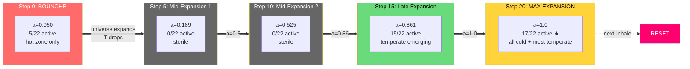
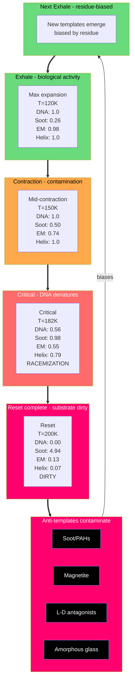
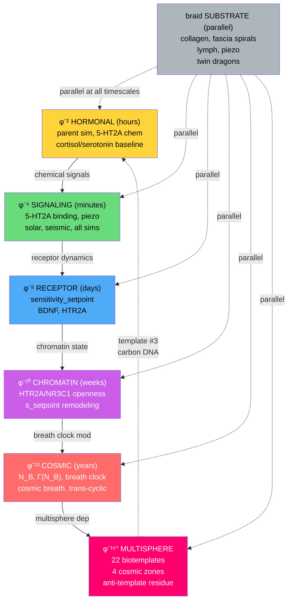
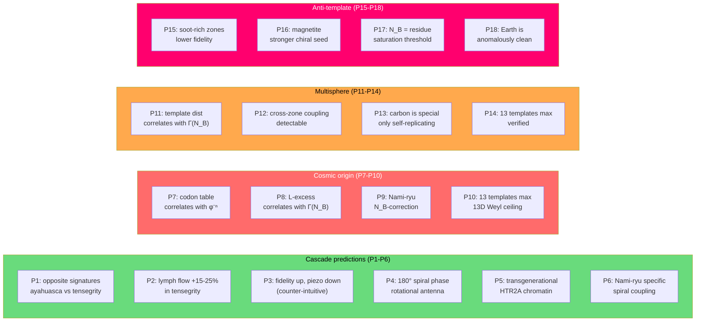

# TAP Multisphere — Mermaid Diagram
## GitHub-renderable visualization of the 22-template cascade

**Date:** 2026-07-01
**Source:** `src/tap_cosmological_cascade_sweep.py`

This doc uses **Mermaid** syntax for the multisphere
cascade. Mermaid renders natively in:
  - GitHub markdown (in `.md` files, in issues, in PRs)
  - GitLab markdown
  - VSCode with Mermaid extension
  - Obsidian
  - Most modern markdown editors

---

## Diagram 1: The 4 zones and 22 templates

---

## Diagram 2: The Bounce → Max Expansion cascade flow

---

## Diagram 3: The anti-template contamination cycle

---

## Diagram 4: The cascade architecture (φ-rate layers)

---

## Diagram 5: Testable predictions summary (P1-P18)

---

## How to use this doc

1. **View in GitHub**: the Mermaid blocks render
   automatically when this `.md` file is viewed on
   github.com
2. **View in VSCode**: install the "Markdown Preview
   Mermaid Support" extension
3. **View in Obsidian**: Mermaid is supported natively
4. **Embed in academic papers**: convert to PNG via
   [mermaid.live](https://mermaid.live) and include as
   figures

The diagrams are also available in:
  - `assets/tap_multisphere_cascade.html` (interactive
    HTML)
  - `docs/TAP_Multisphere_Cascade_Diagram.md` (ASCII art)
  - `docs/TAP_Multisphere_Biotemplates_v5.3.md` (8-template
    v5.3 framing)
  - `docs/TAP_Anti_Template_Residue_v5.3.md` (anti-template
    finding)
  - `docs/TAP_FRAMEWORK_INDEX.md` (master index)
